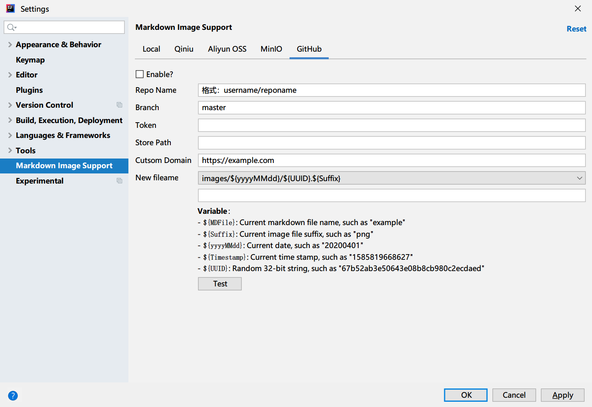

# Jetbrains Markdown Image Support

forked from [wenzewoo repo](https://github.com/wenzewoo/jetbrains-markdown-image-support), see his repo for more details.

based on that, this repo adds a new feature: use GitHub as image hosting service:

[中文文档](./README_CN.md)

