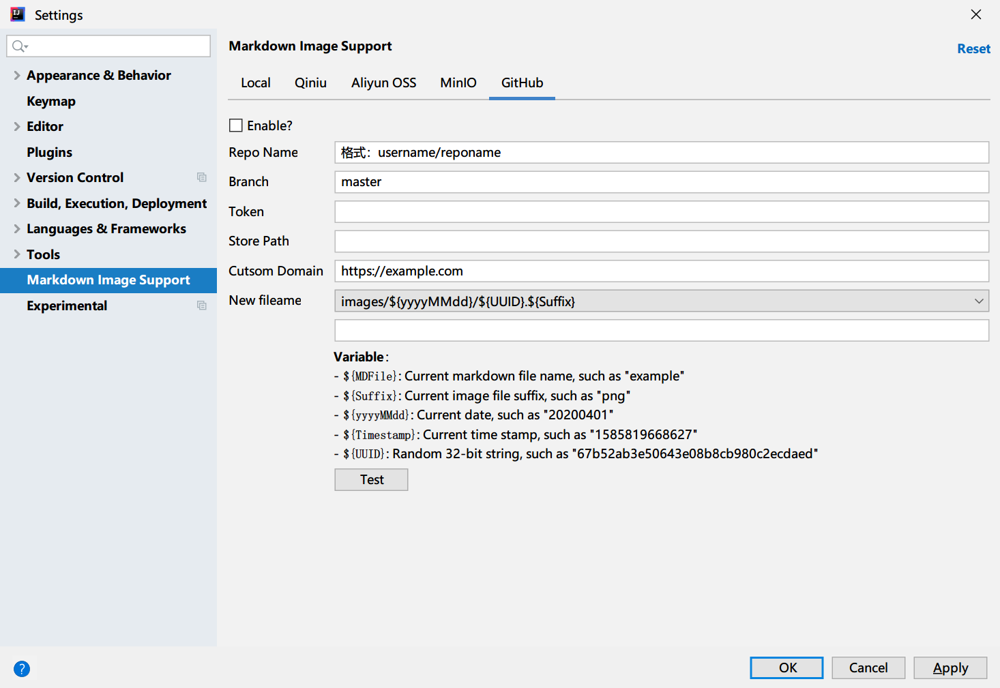

# Jetbrains Markdown Image Support

fork自[wenzewoo repo](https://github.com/wenzewoo/jetbrains-markdown-image-support), 详情请查看该repo.

在此基础上，这个repo增加了一个新特性：使用GitHub作为图片托管服务:

[English Doc](./README.md)